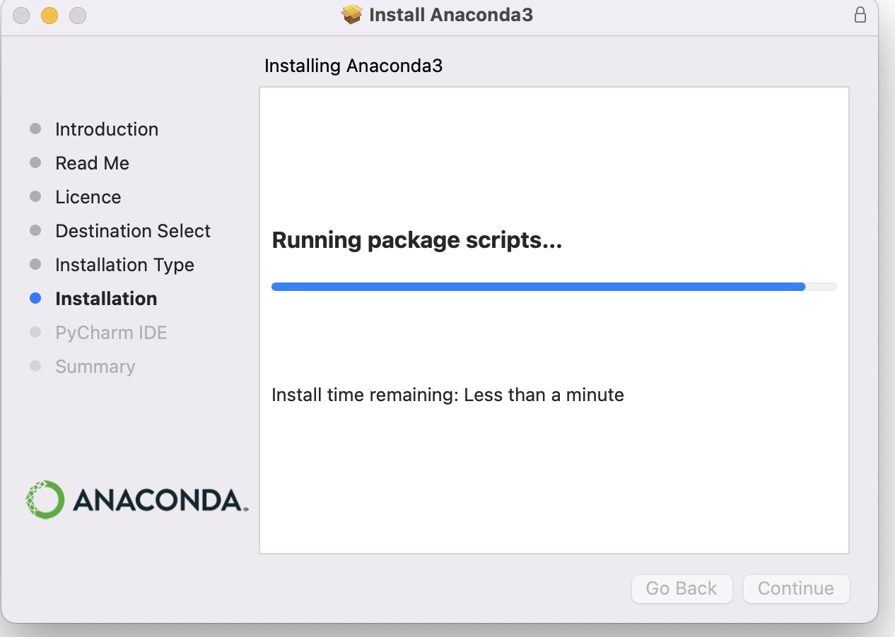

# First Step
 
## Set up Anaconda 
Why use Anaconda?\
Anaconda helps you to create and manage different Python enviroments easily, since different project might use different version of Python and library. It is an essential tool for data scientists and AI researchers.

1. [Download Anaconda](https://www.anaconda.com/products/individual)
1. Install Anaconda 
   


## Set up Github account
Github is a cloud-based hosting service for developers and programmers to share and save their code work.

1. Create/ log in your Github account
1. Set up SSH

### How to set up SSH?
**Step 1**: Check if your computer has SSH key.\
**Step 1.1**: Change directory to hidden file ssh folder.
```bash
cd ~/.ssh
```

**Step 1.2**: List out the content in ssh folder.

```bash
ls
```

Go to step 2 if you don't have id_rsa & id_rsa.pub as per below.\
Go to step 3 if you find id_rsa & id_rsa.pub
 
 


**Step 2**: Generate a SSH key.
```bash
ssh-keygen
```
Back to step 1.2 to make sure SSH key is generated successfully.


**Step 3**: Retrieve SSH key.
```
cat id_rsa.pub
```


**Step 4**: Copy the key shown. It should be begins with 'ssh-rsa'.


**Step 5**: Go to your Github account settings. Find 'SSH and GPG keys' option.


**Step 6**: Add new SSH keys.


## Set up Discord
1. [Download Discord](https://discord.com)
1. Log in your Discord account and join in AMAAI Lab channel
1. Stay connected with AMAAI ~


