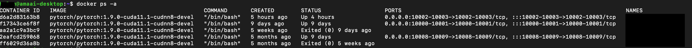

# Using Docker

[Docker](https://www.docker.com/resources/what-container) is a very useful tool to manage different projects in different CUDA environments.

```{note}
Before you use docker, you should at least know the basics of command-line interface (CLI). Please check out our {doc}`linux_tutorial` if you want to learn more about CLI.
```

## Docker Containers

````{list-table} 
:header-rows: 0
:align: right

* - 
  - 
* - Docker Containers (Apps)
  - Virtual Machines  

````

### Code for port mapping of workstation & container
Description: create container with port  mapping to workstation
```bash
nvidia-docker run -it -v /data/[user_name]:/workspace/[user_name] --shm-size=128gb 
-v /etc/timezone:/etc/timezone:ro 
-v /etc/localtime:/etc/localtime:ro -p 100XX-100XX:100XX-100XX 
--name [container_name] pytorch/pytorch:1.9.0-cuda11.1-cudnn8-devel
```


## Docker Images
Description: check the list of stored image
```bash
docker images 
```

```{note}
For the docker image, you can check via [Docker Hub](https://hub.docker.com/search?type=image)
```


## Useful code in docker
### Check GPU status
```bash
nvidia-smi 
```

### List out active container
```bash
docker ps 
```

### List out all the container, including active and non-active 
```bash
docker ps -a  
```


### Enter container
```bash 
docker exec -it [container name] bash 
```

```{note}
If your container is in non-active status, you need to start container before you can enter the container. You can use 'docker ps -a' to check your container status.

```bash
docker start [container_name]
```

### Exit container
```bash
exit
```

### Open jupyter notebook in workstation
```bash
jupyter notebook --ip=0.0.0.0 --port=[100XX] --allow-root --no-browser
```
```{note}
Browser to jupyter with port number: http://localhost:100XX/
```

### Monitor GPU running progress
Description: can customize the updated timeframe for GPU. For example, request updated in every 0.2s.
```bash
watch -d -n 0.2 nvidia-smi 
```


