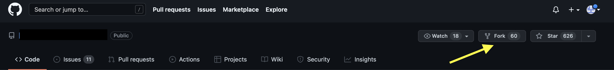
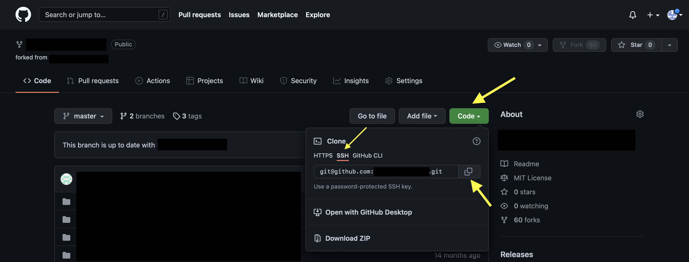

# Git Cheatsheet

## Add a file to your next commit
```bash
git add AMAAI
```

## Add *all* file to your next commit

```bash
git add .
```

## Descript your commit content

```bash
git commit -m 'description of this committed file'
```

## List out and show which branch you are locating at
```bash
git branch
```

## Create a new branch
```bash
git checkout -b [branch]
```

## Switch to another branch
```bash
git checkout [branch]
```

## Update local branch commits to GitHub
```bash
git push origin [branch_name]
```

## Show modified files in working directory

```bash
git status
```

## Show the different of what is changed but not committed
```bash
git diff [file]
```

## Show the commit history for currently active branch
```bash
git log
```

## Ignore folder or file when you process commit
Use nano which is a text editor to open .gitignore.
All the folder and file inside .gitignore will be ignored and won’t be committed to GitHub.
```bash
nano .gitignore
```

```{note}
Any file begin with ‘.’ represent hidden file which is only shown in ‘ls -a’
```

## Retrieve an repository from a hosted location via URL
```bash
git clone [url]
```

### How to get URL for a repository?
**Step 1**: go to the repository page that you wanna clone.
Download repository to your own GitHub account by clicking ‘fork’ button. 


**Step 2**: go to your repository page and click ‘Code’ button.



For more Git commands, you can check via GitHub Education


